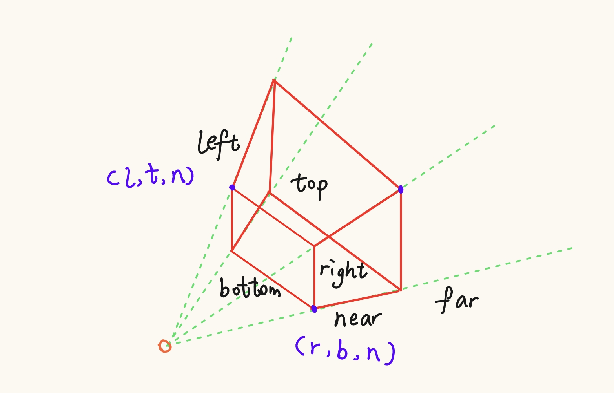

$$V_{pixel} = \underbrace{M_{viewport} \times \underbrace{M_{projection} \times \underbrace{M_{view} \times M_{model}}_{\text{ModelView}} \times V_{local}}_{\text{投影与裁剪}}}_{\text{最终像素}}$$
# 透视投影矩阵Perspective
它的核心作用是产生“远小近大”的视觉效果，通过操作齐次坐标中的 $w$ 分量来实现。

$$P = \begin{bmatrix} \frac{2n}{r-l} & 0 & \frac{r+l}{r-l} & 0 \\ 0 & \frac{2n}{t-b} & \frac{t+b}{t-b} & 0 \\ 0 & 0 & -\frac{f+n}{f-n} & -\frac{2fn}{f-n} \\ 0 & 0 & -1 & 0 \end{bmatrix}$$

# 模型矩阵 ModelView
## 第一步：模型变换 (Model Transformation)

**目标：将物体放进世界坐标系。**

在这个阶段，我们对模型进行操作，使它在世界中拥有正确的位置和形态。通常包含三个子步骤（注意顺序很重要）：

1. **缩放 (Scaling)**：改变物体的大小。
    
2. **旋转 (Rotation)**：让物体面朝正确的方向。
    
3. **平移 (Translation)**：将物体移动到世界坐标 $(x, y, z)$。
    

**公式表达**：$M_{model} = T \times R \times S$ （先缩放，再旋转，最后平移）。
## 第二步：视图变换
### 1. 建立相机坐标系 (UVN 坐标系)

通过 `eye`, `at`, `up` 三个参数，算出相机在世界空间里的三根轴：

- **$\vec{n}$ (Forward)**: `normalize(eye - at)` （指向相机背后）
    
- **$\vec{u}$ (Right)**: `normalize(up × n)`
    
- **$\vec{v}$ (Up)**: `n × u` （修正后的正上方）
### 2. 构造旋转部分 ($R_{view}$)

我们要把世界坐标轴旋转到与 $u, v, n$ 对齐。根据正交矩阵的性质，旋转矩阵的逆等于它的转置：

$$R_{view} = \begin{bmatrix} u_x & u_y & u_z & 0 \\ v_x & v_y & v_z & 0 \\ n_x & n_y & n_z & 0 \\ 0 & 0 & 0 & 1 \end{bmatrix}$$

## 3. 构造平移部分 ($T_{view}$)

我们要把世界原点平移到相机的负位置（因为要把相机移回原点）：

$$T_{view} = \begin{bmatrix} 1 & 0 & 0 & -eye_x \\ 0 & 1 & 0 & -eye_y \\ 0 & 0 & 1 & -eye_z \\ 0 & 0 & 0 & 1 \end{bmatrix}$$

**合成 $M_{view} = R_{view} \times T_{view}$。
最终
$$M_{ModelView} = M_{view} \times M_{model}$$
# 视口变换矩阵 Viewport
>将经过投影变换后处于 **标准设备坐标系 (NDC)** 中的点，映射到屏幕上的**像素坐标系**。
>在 NDC 坐标系中，点的范围通常是 $x, y \in [-1, 1]$。而屏幕窗口（视口）范围是 $x \in [x_{offset}, x_{offset} + w]$，$y \in [y_{offset}, y_{offset} + h]$。
---
## 1. 矩阵推导：分步拆解
本质上是一个**缩放 (Scale)** 加上一个**平移 (Translation)**。
### 第一步：缩放 (Scaling)

我们要把长度为 $2$ 的区间（从 $-1$ 到 $1$）映射到长度为 $w$（宽度）和 $h$（高度）的区间。

- $x$ 方向的缩放比例：$w / 2$
    
- $y$ 方向的缩放比例：$h / 2$
    

此时，原本 $[-1, 1]$ 的范围变成了 $[-w/2, w/2]$ 和 $[-h/2, h/2]$。
### 第二步：平移 (Translation)

此时中心点还在 $(0,0)$，但屏幕坐标的起点通常在左下角或左上角。

- 我们需要把 $x$ 范围从 $[-w/2, w/2]$ 移动到 $[x_{offset}, x_{offset} + w]$。
    
- 中心点需要平移的距离是：$x_{offset} + w/2$。
    
- 同理，$y$ 方向平移的距离是：$y_{offset} + h/2$。
    

---

## 2. 矩阵结构分析

结合上面的推导，我们构造一个 $4\times4$ 的齐次变换矩阵：

$$Viewport = \begin{bmatrix} \frac{w}{2} & 0 & 0 & x + \frac{w}{2} \\ 0 & \frac{h}{2} & 0 & y + \frac{h}{2} \\ 0 & 0 & 1 & 0 \\ 0 & 0 & 0 & 1 \end{bmatrix}$$

- **第一行 `[w/2, 0, 0, x+w/2]`**：处理 $x$ 坐标。乘法项是 $w/2$，加法项（平移）是 $x+w/2$。
    
- **第二行 `[0, h/2, 0, y+h/2]`**：处理 $y$ 坐标。
    
- **第三行 `[0, 0, 1, 0]`**：$z$ 坐标通常保持不变，或者映射到 $[0, 1]$ 用于深度缓冲。
    
- **第四行 `[0, 0, 0, 1]`**：保持齐次坐标 $w=1$。